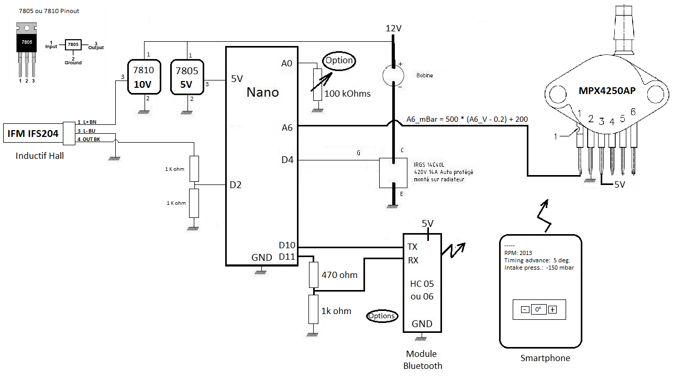

# aepl-duino

Playing with
[existing programmable car engine ignition software](http://a110a.free.fr/SPIP172/article.php3?id_article=142)
for [Arduino](https://www.arduino.cc/).

The intent is to modify
[the initial version](http://a110a.free.fr/SPIP172/IMG/txt/Aepl-Duino_11_10_18.txt) written by
[Philippe Loutrel](http://a110a.free.fr/SPIP172/auteur.php3?id_auteur=1) to take into account the
depression in the [inlet manifold](https://en.wikipedia.org/wiki/Inlet_manifold).

This modification has been designed and validated by
[Florian Lourot](https://www.linkedin.com/in/florian-lourot-3a7423a5).

