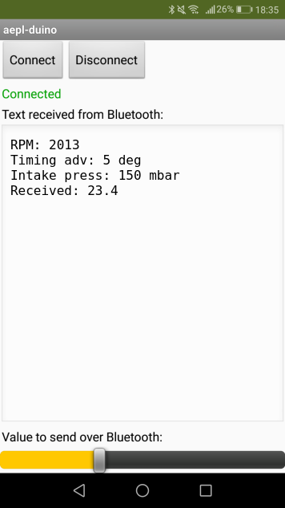

# Android app

This app is implemented with the [MIT App Inventor](http://ai2.appinventor.mit.edu/) like in
[this tutorial](https://howtomechatronics.com/tutorials/arduino/how-to-build-custom-android-app-for-your-arduino-project-using-mit-app-inventor/).

* [Sources to be imported in MIT App Inventor](aepl_duino.aia)
* [APK to install on your phone](aepl_duino.apk)

> **NOTES**:
>
> * If your Bluetooth device doesn't show up in the list when pressing `Connect`, make sure you have
>   paired it first. Default settings:
>     - SSID: `HC-05`
>     - password: `1234`
> * The message format between the Arduino and the Android app is described
>   [here](bt-msg-format.md).
